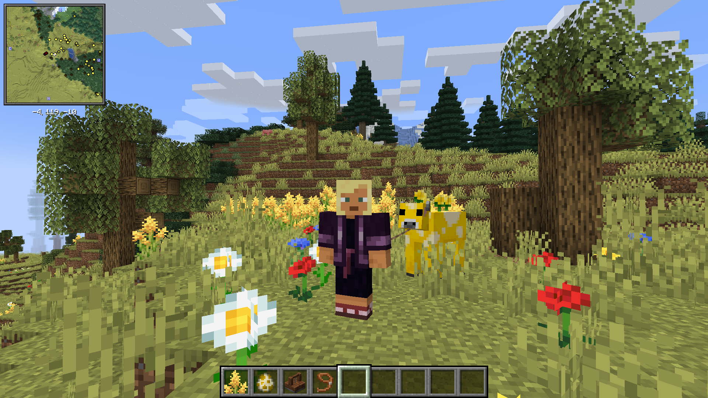

# Minecraft+
> A + Minecraft modpack

| Minecraft ver |
| ------------- |
| `1.21.1`      |

| Loader   | Ver       | Source                                                       | Repo                                            |
| -------- | --------- | ------------------------------------------------------------ | ----------------------------------------------- |
| NeoForge | `21.1.72` | [Website](https://projects.neoforged.net/neoforged/neoforge) | [GitHub](https://github.com/neoforged/neoforge) |

## Mods & resource packs list

|                              Mods                              |
| :------------------------------------------------------------: |
|                    [Create](docs/Create.md)                    |
| [Create Steam 'n' Rails](docs/Create%20Steam%20'n'%20Rails.md) |
|       [Just Enough Items](docs/Just%20Enough%20Items.md)       |
|        [Biomes O' Plenty](docs/Biomes%20O'%20Plenty.md)        |
|                   [Sawmill](docs/Sawmill.md)                   |
|          [Friends & Foes](docs/Friends%20&%20Foes.md)          |
|   [What are they up to](docs/What%20are%20they%20up%20to.md)   |
|          [Xaero's Minimap](docs/Xaero's%20Minimap.md)          |
|                  [BetterF3](docs/BetterF3.md)                  |
|               [Apple Skin](docs/Apple%20Skin.md)               |

